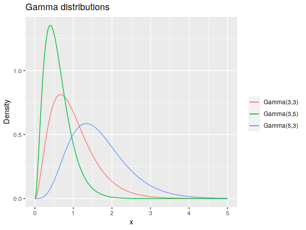

Among all probability distributions, the normal distribution is probably the most well-established and well-characterized.  The importance of things like the central limit theorem and the normality assumptions in linear regression highlight it well.

One of the more interesting ones is the fact that [you can approximate a binomial distribution with a normal one](https://en.wikipedia.org/wiki/Binomial_distribution#Normal_approximation).  Using a continuous distribution to approximate a discrete one feels a little weird, and there are certain assumptions needed for it to work, but it raises an interesting question -- how normal can other distributions look?

<!--more-->

### Detecting Normality

To detect normality, we need a specific method for doing so.  Eyeballing it isn't a rigorous way, and it's probably not that sensitive.  For instance, consider the histogram and its density below:

It looks reasonably normal, but it's actually a \\(t\\)-distribution with 100 degrees of freedom.  The \\(t\\)-distribution being approximately normal with enough degrees of freedom is well-known, but it's got to be a pretty good approximation to fool a test.  If you run the snippet below a number of times, you should see the \\(p\\)-value for the test bounce all over the place -- in about a dozen runs on my own, I saw values from 0.31 to 0.0000002.


t_data <- rt(4000, df=100, ncp=5)
shapiro.test(t_data)


For our experimentation, we'll employ the [Shapiro-Wilk test](https://en.wikipedia.org/wiki/Shapiro%E2%80%93Wilk_test) like above.  The null hypothesis for this test is that the data is normally distributed, and the alternative is that it's non-normal.  It's in base R (as `shapiro.test()`) and it has [good power among various normality tests](https://www.researchgate.net/publication/267205556_Power_Comparisons_of_Shapiro-Wilk_Kolmogorov-Smirnov_Lilliefors_and_Anderson-Darling_Tests), although we'll be using 4000 samples for each test, which is enough that many tests are very reliable.

The \\(p\\)-value will be our metric for how normal it looks.  We aren't going to focus on a threshold value for what looks normal "enough," we're just going to look at how the \\(p\\)-values broadly change based on the distributions' parameters.  To try to counteract the issue of fluctuations between runs, like with the \\(t\\)-distributed data above, we'll actually look at the median \\(p\\)-value from 15 separate tests.

A note of caution:  The high power that comes with the large sample size means that the test is going to be quite zealous about rejecting the null if it detects any non-normality.  If you're dealing with smaller samples, Shapiro-Wilk is going to be more forgiving about minor deviations from the normal distribution, and the results of these simulations would change.  I would encourage you to download the code and see the effects of changing the sample size \\(N\\) if you want to get a better sense of this.

### The Beta Distribution

A favorite for modeling the probability of something, the beta distribution's domain is confined to [0,1], and it's shape is described by two parameters, denoted here by \\(a\\) and \\(b\\).  Generally, the distribution looks fairly symmetric when both parameters are nearly equal, so we'd expect it to look more normal as they get close in value.

And that's precisely what we get:

When both parameters start getting larger, the variance -- which goes roughly as \\(ab/(a^3 + b^3)\\) -- starts to drop off, so you can have quantitatively larger differences between the parameter values.  It also becomes normal-looking quite quickly, with the test starting to fail to reject the null around \\(a=b=10\\) for typical significance levels.

Side note: I tried to visualize the log of the \\(p\\)-values, in the hope that it might better differentiate values below, say, 0.01 or so.  It doesn't work as I'd hoped, as the values along the left and bottom sides of the grid go down to about 10^-42, which ends up drowning out nuance in values closer to 1.

### The Gamma Distribution

The gamma distribution is a little trickier to describe, as there are two ways of parameterizing it: either shape and scale, or shape and rate.  We'll use the latter here, denoted by \\(\alpha\\) and \\(\beta\\) respectively as it's what I've usually seen.

Describing the effects of these coefficients in plain English is a little trickier, but broadly, the shape tends to spread out the probability mass to the right, while the rate tends to tighten it towards the left.  Or you could just note that the mean of the distribution is \\(\alpha/\beta\\) and its variance is \\(\alpha/\beta^2\\).

This time around, one parameter -- the rate \\(\beta\\) -- doesn't appear to have much to do with how normal it looks.  Which might be a little surprising, given that the variance scales with \\(1/\beta^2\\), so you might think the distribution would "tighten up" and look more normal as \\(\beta\\) ramps up.  But if you look into the details of the gamma distribution, you'll see that its' skewness is \\(2/\sqrt{\alpha}\\), meaning it won't change with \\(\beta\\) at all and won't change that fast once \\(\alpha\\) starts getting larger, which is consistent with what we're seeing.

### The Binomial Distribution

As mentioned before, it can seem odd to model a discrete distribution with a continuous one.  But it works fairly well, once you have some larger values:

The binomial has two parameters, the number of trials \\(n\\) and the probability of success \\(p\\).  Since the density is confined to only be nonzero from 0 to \\(n\\), we end up with a similar problem as the beta distribution: the distribution can have significant tails on it, but can also be centered and fairly symmetric, depending on the parameters.  In this case, we'd expect a more symmetric distribution -- and consequently, a better normal approximation -- the closer you are to \\(p=0.5\\), which does occur:

Wikipedia gives a few different circumstances under which approximating the binomial distribution as normal is reasonable, but the Shapiro-Wilk test seems to reject the samples' normality at anything near those parameters.  For instance, one suggestion is that when \\(np\\) and \\(n(1-p)\\) are both above 5, the normal approximation can work; eyeballing the above plot, Shapiro-Wilk seems to only start accepting the binomial as normal when both values are over 100.  Considering that this is a fairly old and seemingly well-used approximation -- there's [one theorem](https://en.wikipedia.org/wiki/De_Moivre%E2%80%93Laplace_theorem) for it dating back to 1738 -- I suspect this is less a case of "this isn't actually a great approximation" as much as it's "Shapiro-Wilk is pretty strict, especially with 4000 samples".

### The Poisson Distribution

The Poisson is another discrete distribution, though unlike the previous distributions, it only has a single rate parameter, \\(\lambda\\), that defines the distribution.

As before, higher parameter values produce more normal-looking curves.  Since we've only got one parameter, we switch to a basic scatter plot, where we can now employ a smoothing line to get a more precise sense of the general trend.

It looks like the smoothing line goes over \\(p=0.05\\) somewhere around \\(\lambda = 300\\), though it doesn't get larger that much faster.  A normal approximation for the Poisson doesn't seem to be as prominent as it is for the binomial, but a cursory internet search turns up several mentions of it working when \\(\lambda\\) exceeds either 100 (possibly with a continuity correction) or 1,000.  It looks like our test believed our samples were normal almost all of the time (for any typical significance level) near \\(\lambda=1000\\), which means it really is a good approximation there.

### Final Notes

The code used to generate these simulations is [here](code.R).

I don't know how common it is to have distributions with parameter values at these extremes in real-life situations.  Maybe the Poisson distribution, if you end up with a large enough time scale for your experiment that you get a lot of events in there, but I don't really know.

I'll close by referencing the old saying about how every problem looks like a nail when you have a hammer.  If circumstances are right, it seems that the normal distribution makes for a pretty good hammer.
